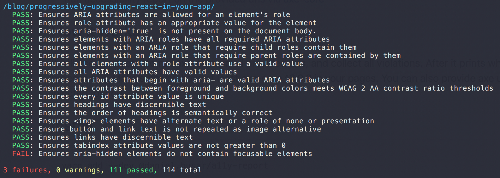

# a11y-report
> Run accessibility report on the provided urls via [axe-core](https://github.com/dequelabs/axe-core)

## How it works
Using [puppeeter](https://github.com/GoogleChrome/puppeteer) we run axe-core on all provided urls and collect all violations.

Make sure you have at least axe-core ^3.0.0 loaded in your pages or provide [axe url](#axeurl) to be automatically injected for you.



## Install

```sh
yarn add --dev @daniel.husar/a11y-report
```
or
```sh
npm install --dev @daniel.husar/a11y-report
```

## Usage

```js
const report = require('@daniel.husar/a11y-report');

const config = {
  urls: ['http://localhost:9001/index.html'],
  axeUrl: 'https://cdnjs.cloudflare.com/ajax/libs/axe-core/3.2.2/axe.min.js'
}

report(config);
```

## API

### report(config)

Returns void and prints accessibility report. It will process exit with 1 if there are any errors, or 0 with no errors.

#### urls

Type: `string[]`

Array of urls to run report on.

#### delay

Type: `number`

Default: `100`

Delay to wait for `axe-core` to be executed.

#### axeUrl

Type: `string | undefined`

Default: `undefined`

Every page needs axe-core script to be loaded. If your pages don't load axe-core, you can provide axe-core url to be injected.
Example: `https://cdnjs.cloudflare.com/ajax/libs/axe-core/3.2.2/axe.min.js`

#### ignoreViolations

Type: `string[]`

Global array of all violations that should be ignored.

#### ignoreViolationsForUrls

Type: `object`

Example: `ignoreViolationsForUrls: { 'http://localhost:9001/index.html': ['Violation to ignore'] }`

Mappings of violations per url to ignore.

#### errorTags

Type: `string[]`

Default: `['wcag2a', 'wcag2aa', 'wcag21aa']`

Array of tags which would consider violation as error or warning.

#### reporter

Type: `default | simple`

Default: 'default'

Which reporter to use.

#### logger

Type: `fn`

Default: 'console.log`

Logger function to use.

#### exitProcess

Type: `boolean`

Default: `true`

If the current process should exit with exit code 1 if there are errors, or 0 for no errors.

#### axe

Type: `object`

[Axe-core](https://github.com/dequelabs/axe-core) config.

##### axe.context
Type: `object`

Default: `element: { include: ['html'] }`

[Context parameter](https://github.com/dequelabs/axe-core/blob/develop/doc/API.md#context-parameter).

##### axe.options
Type: `object`

Default: `{}`

[Axe-core options parameter](https://github.com/dequelabs/axe-core/blob/develop/doc/API.md#options-parameter).

## License
MIT
